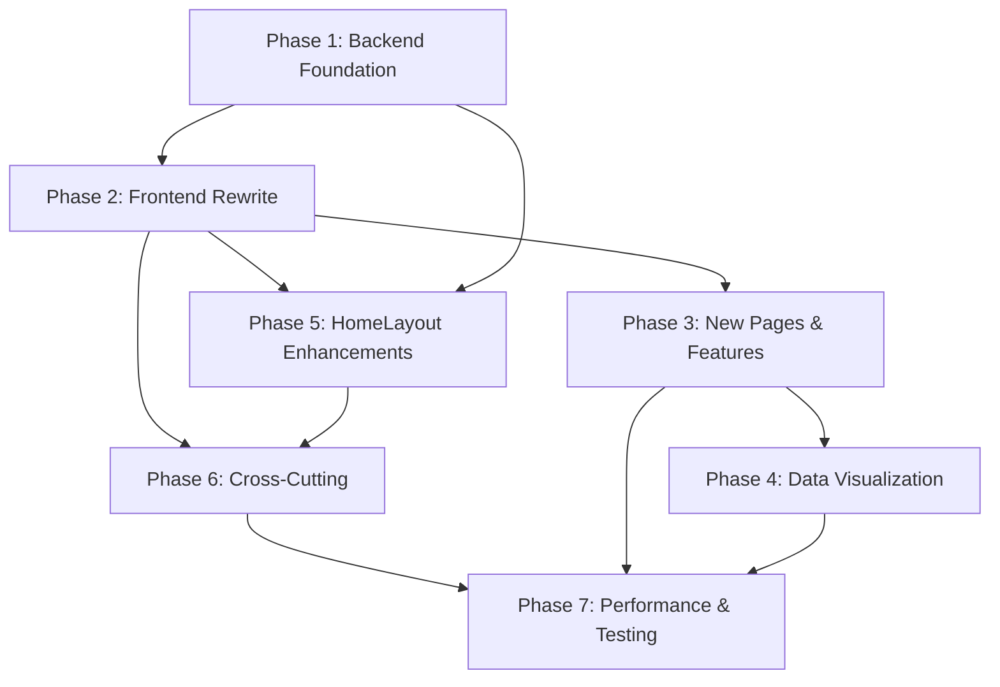

# Comprehensive Enhancement & Optimization Masterplan

> **Date:** July 8, 2026  
> **Project:** Full-Ecommerce App (Vue 3 + Express 5 + PostgreSQL)  
> **Focus Area:** Admin Dashboard (primary), HomeLayout (secondary)

---

## Table of Contents
1. [Executive Summary](#1-executive-summary)
2. [Current Architecture Overview](#2-current-architecture-overview)
3. [Phase 1: Admin Dashboard — Backend Foundation](#3-phase-1-admin-dashboard--backend-foundation)
4. [Phase 2: Admin Dashboard — Frontend Rewrite](#4-phase-2-admin-dashboard--frontend-rewrite)
5. [Phase 3: Admin Dashboard — New Pages & Features](#5-phase-3-admin-dashboard--new-pages--features)
6. [Phase 4: Admin Dashboard — Data Visualization & Analytics](#6-phase-4-admin-dashboard--data-visualization--analytics)
7. [Phase 5: HomeLayout & Public-Facing Enhancements](#7-phase-5-homelayout--public-facing-enhancements)
8. [Phase 6: Cross-Cutting Concerns](#8-phase-6-cross-cutting-concerns)
9. [Phase 7: Performance & Testing](#9-phase-7-performance--testing)
10. [Implementation Order & Dependencies](#10-implementation-order--dependencies)
11. [Risk Assessment](#11-risk-assessment)
12. [Decision Log](#12-decision-log)

---

## 1. Executive Summary

This plan systematically enhances the e-commerce application, prioritizing the **admin dashboard** while also improving the public-facing storefront. The current dashboard has strong visual foundations but suffers from:

- **Hardcoded / dummy data** (revenue, orders, growth percentages, notifications)
- **Incomplete backend integration** (stock updates, reports, analytics are simulated)
- **Inconsistent styling** (some views use old `bg-gray-*` / `text-gray-*` instead of theme tokens)
- **No real-time features** (websockets, polling for live updates)
- **Missing pages** (orders management, discount management, settings, audit logs)
- **Poor error feedback** (uses `alert()` instead of toast notifications)
- **Underpowered analytics** (no charts, no real sales data pipeline)

Each phase is independently deployable and delivers value even without subsequent phases.

---

## 2. Current Architecture Overview

### Frontend (`vue-project/`)
| Layer | Technology | Key Files |
|-------|-----------|-----------|
| Framework | Vue 3 (Composition API) + Vite 7 | `main.js`, `App.vue` |
| Routing | Vue Router 4 | `router/index.js` |
| State | Pinia (Options API) | `stores/auth.js`, `stores/product.js`, `stores/shop.js`, `stores/ui.js` |
| Styling | Tailwind CSS v4 (`@theme` tokens) | `assets/main.css` |
| API | Axios instance with interceptors | `api/api.js` |
| Dashboard Layout | `DashboardLayout.vue` | Responsive sidebar, top bar, notification dropdown |
| Dashboard Views | 7 views | Dashboard, AddProduct, ManageProducts, ManageStocks, ManageUser, Analytic, Reports |

### Backend (`server/`)
| Layer | Technology | Key Files |
|-------|-----------|-----------|
| Server | Express 5 | `main.js` |
| Database | PostgreSQL + `pg` Pool | `database/dbpool.js` |
| Auth | JWT + bcrypt | `middleware/authMiddleWare.js` |
| Dashboard API | Routes → Controller → Service | `routes/dashboardRoutes.js` → `dashboardController.js` → `dashboardService.js` |

### Key Pain Points Identified

#### Dashboard Backend (`dashboardService.js`)
1. **Revenue data is hardcoded:** `{ today: 0, week: 0, month: 0, growth: 0 }` — no actual queries against orders
2. **Orders data is hardcoded:** `{ total: 0, pending: 0, processing: 0, completed: 0 }` — no actual order queries
3. **Analytics returns empty sales_trend:** `sales_trend: []` — no time-series sales data
4. **Analytics returns zero revenue:** `total_revenue: 0, total_orders: 0, average_order_value: 0` — not querying payments/orders
5. **Category analytics** counts products per category using baseprice * quantity (not actual sales)
6. **Low stock query** uses `HAVING SUM(s.quantity) > 0 AND SUM(s.quantity) < 10` — functionally correct but could return wrong count with DISTINCT

#### Dashboard Frontend (`Dashboard.vue`)
1. **Recent orders** are computed from an empty `orders.value` array — always shows "no orders yet"
2. **Revenue data** relies on `dashboardStats.value?.revenue` which is always 0 from backend
3. **Top products** sorts by `final_price` not actual sales data
4. **Activities feed** shows backend data correctly (new users, new products)
5. **No real-time data** — no polling or WebSocket for live updates

#### Analytics Page (`Analytic.vue`)
1. **Growth percentages** are hardcoded (`+15.3%`, `+12.5%`, etc.) should come from backend
2. **Sales trend chart** uses bar widths as `(data.sales / maxSales) * 100` but sales data is always 0
3. **Product performance** uses hardcoded `1200` for percentage calculation
4. **Uses old design tokens** (`bg-blue-100`, `text-blue-600`, raw SVG icons instead of lucide)
5. **Hardcoded "Retry" button** uses raw Tailwind colors instead of theme system

#### Reports Page (`Reports.vue`)
1. **Entirely frontend-simulated** — no API calls for report generation
2. **Uses `alert()`** for success and delete confirmations
3. **Download buttons** are stubs (`alert('Downloading: ...')`)
4. **Delete functionality** only affects local state, no API integration
5. **Uses old `bg-gray-*` / `text-gray-*` styling** in some structures

#### Stock Management (`ManageStocks.vue`)
1. **`updateStock()` is a no-op with `console.log`** — has `// TODO: Call API to update stock`
2. **Uses `alert()`** for success/error feedback
3. **Filters are client-side only** — should be server-side for large inventories
4. **No stock change history/log viewer**

#### Product Management (`ManageProducts.vue`)
1. **Uses `alert()`** for success messages and delete confirmation
2. **Some old `bg-gray-*` / `text-gray-*` styling remnants**
3. **No bulk product actions** (bulk status change, bulk delete, bulk export)
4. **No inline editing** (must navigate to AddProduct for edit)

#### User Management (`ManageUser.vue`)
1. **Uses `alert()`** for CRUD operations
2. **Status field** (`active`/`inactive`) doesn't exist in the database — always shows "active"
3. **Orders count** is hardcoded as `0` — no actual order count per user
4. **Role logic** merges `role_id 1 & 2` as "Admin" — correct but could be more transparent

#### Add Product (`AddProduct.vue`)
1. **Uses `alert()`** for success/error feedback
2. **Variant form** uses legacy `size`/`color` model — should support new `options[]` system
3. **Stock form** duplicates variant logic — should be integrated
4. **No image preview** before submission
5. **No edit mode** — the router supports `?edit=id` but component doesn't handle it

#### DashboardLayout (`DashboardLayout.vue`)
1. **Notifications are hardcoded demo data** — 3 static notifications
2. **No orders management link** in sidebar navigation
3. **User menu "Profile" and "Settings" are no-ops** — not linked to any route
4. **Search input has no actual search functionality**
5. **Badge count "5" on Inventory is hardcoded**

---

## 3. Phase 1: Admin Dashboard — Backend Foundation

### Objective
Fix the dashboard backend to return real data from the database instead of hardcoded zeros.

### Tasks

#### 1.1 Dashboard Service: Real Revenue & Orders Data

**File:** `server/src/services/dashboardService.js`

- [ ] Query `orders` table for revenue data (today, this week, this month)
- [ ] Query `orders` table for order statistics (total, pending, processing, completed, cancelled)
- [ ] Calculate revenue growth percentage between current and previous period
- [ ] Implement `getOrderStats()` function
- [ ] Implement `getRevenueStats()` function
- [ ] Wire these into `getDashboardStats()`

**SQL patterns needed:**
```sql
-- Revenue by period
SELECT
    COALESCE(SUM(CASE WHEN createdat::date = CURRENT_DATE THEN totalamount ELSE 0 END), 0) AS today,
    COALESCE(SUM(CASE WHEN createdat >= date_trunc('week', CURRENT_DATE) THEN totalamount ELSE 0 END), 0) AS week,
    COALESCE(SUM(CASE WHEN createdat >= date_trunc('month', CURRENT_DATE) THEN totalamount ELSE 0 END), 0) AS month
FROM orders
WHERE status NOT IN ('cancelled');

-- Order status counts
SELECT
    COUNT(*) AS total,
    COUNT(*) FILTER (WHERE status = 'pending') AS pending,
    COUNT(*) FILTER (WHERE status = 'confirmed') AS processing,
    COUNT(*) FILTER (WHERE status = 'delivered') AS completed,
    COUNT(*) FILTER (WHERE status = 'cancelled') AS cancelled
FROM orders;

-- Revenue growth (compare current month to previous month)
WITH current_month AS (
    SELECT COALESCE(SUM(totalamount), 0) AS revenue
    FROM orders
    WHERE date_trunc('month', createdat) = date_trunc('month', CURRENT_DATE)
      AND status NOT IN ('cancelled')
),
previous_month AS (
    SELECT COALESCE(SUM(totalamount), 0) AS revenue
    FROM orders
    WHERE date_trunc('month', createdat) = date_trunc('month', CURRENT_DATE - INTERVAL '1 month')
      AND status NOT IN ('cancelled')
)
SELECT
    CASE WHEN previous_month.revenue > 0
         THEN ROUND(((current_month.revenue - previous_month.revenue) / previous_month.revenue) * 100, 1)
         ELSE 0
    END AS growth
FROM current_month, previous_month;
```

#### 1.2 Dashboard Service: Recent Orders

**File:** `server/src/services/dashboardService.js`

- [ ] Add `getRecentOrders(limit = 5)` function querying the orders table with user/items join
- [ ] Wire into `getDashboardStats()` response
- [ ] Return: `{ id, customer, status, amount, items_count, created_at }`

#### 1.3 Dashboard Service: Top Products by Sales

**File:** `server/src/services/dashboardService.js`

- [ ] Add `getTopProducts(limit = 5)` function
- [ ] Query `orderitems` grouped by product, summing quantities
- [ ] Join with `products` for name, image, price
- [ ] Wire into `getDashboardStats()` response

#### 1.4 Analytics Service: Real Data Pipeline

**File:** `server/src/services/dashboardService.js`

- [ ] `getAnalytics()` — replace zero placeholders with actual queries:
  - `total_revenue`: SUM of order totalamounts for the period
  - `total_orders`: COUNT of orders for the period
  - `total_customers`: COUNT of distinct users who placed orders
  - `average_order_value`: total_revenue / total_orders
- [ ] Add `sales_trend` data: group orders by day/week/month within period
- [ ] Calculate actual growth percentages for each metric (compare current period to previous)
- [ ] Fix `category_data` to use actual order revenue, not baseprice × stock

#### 1.5 Dashboard API Routes: Add New Endpoints

**File:** `server/src/routes/dashboardRoutes.js`

- [ ] Add `GET /api/dashboard/recent-orders` endpoint
- [ ] Add `GET /api/dashboard/top-products` endpoint
- [ ] Add `GET /api/dashboard/revenue` endpoint (with period query param)

#### 1.6 Reports Backend API

**Files:** `server/src/routes/dashboardRoutes.js`, `server/src/services/dashboardService.js`

- [ ] Add `GET /api/dashboard/reports` endpoint with query params: `type` (sales/inventory/customer/financial), `dateRange` (week/month/quarter/year/custom), `startDate`, `endDate`
- [ ] Implement `generateReport()` service function returning structured report data
- [ ] Add `GET /api/dashboard/reports/history` to list generated reports
- [ ] Add `POST /api/dashboard/reports/generate` to generate and store a report
- [ ] Add `DELETE /api/dashboard/reports/:id` to delete stored reports

**New database table suggestion:** `reports` table:
```sql
CREATE TABLE reports (
    reportsid SERIAL PRIMARY KEY,
    name VARCHAR(255) NOT NULL,
    type VARCHAR(50) NOT NULL,
    parameters JSONB,
    data JSONB,
    filesize_kb INTEGER DEFAULT 0,
    createdat TIMESTAMP DEFAULT CURRENT_TIMESTAMP
);
```

**Note:** Report generation can start with JSON data export; PDF generation can be added later.

---

## 4. Phase 2: Admin Dashboard — Frontend Rewrite

### Objective
Fix the frontend dashboard pages to properly integrate with the backend, unify styling, and replace `alert()` with toast notifications.

### Tasks

#### 2.1 Dashboard.vue — Real Data Integration

**File:** `vue-project/src/views/dashboard/Dashboard.vue`

- [ ] **Add API calls for orders:** fetch recent orders from `GET /api/dashboard/recent-orders` or `GET /api/orders` (new endpoint)
- [ ] **Add API call for top products:** fetch from `GET /api/dashboard/top-products`
- [ ] **Remove local computed fallbacks** for orders, revenue, top products
- [ ] **Fix revenue display:** use real data from `dashboardStats.value.revenue`
- [ ] **Growth percentage** should come from backend, not hardcoded
- [ ] **Fix `getStatusBadge()`** to map to actual order DB status values (`pending`, `confirmed`, `shipped`, `delivered`, `cancelled`)
- [ ] **Add polling** for live dashboard feel (refresh every 30s)
- [ ] **Replace `alert()`** with `useToast()` notifications where applicable
- [ ] **Add "View all orders" link** → new `/admin/orders` page (Phase 3)

**API layer updates needed:**
**File:** `vue-project/src/api/dashboardApi.js`
- [ ] Add `getRecentOrders(limit)` method
- [ ] Add `getTopProducts(limit)` method

#### 2.2 Analytic.vue — Full Rebuild

**File:** `vue-project/src/views/dashboard/Analytic.vue`

- [ ] **Unify styling:** Replace all old color classes with theme tokens
  - `bg-blue-*` → appropriate `bg-accent-*` / `bg-neutral-*`
  - Raw SVG icons → `lucide-vue-next` components
  - `bg-red-50` → consistent theme error styling
- [ ] **Remove hardcoded growth percentages:** Use real data from backend
- [ ] **Fix sales trend chart:** Replace bar chart with proper CSS-based chart using real backend data
- [ ] **Fix product performance table:** Remove hardcoded `1200` — use dynamic max value
- [ ] **Replace "Retry" button styling** with theme `btn-primary` class
- [ ] **Add period comparison:** show % change vs previous period for each metric
- [ ] **Add date range picker** for custom timeframes

#### 2.3 Reports.vue — Backend Integration

**File:** `vue-project/src/views/dashboard/Reports.vue`

- [ ] **Unify styling:** Replace old `bg-gray-*` / `text-gray-*` with theme tokens
- [ ] **Replace `alert()`** with toast notifications using `useToast()`
- [ ] **Implement actual API call** for report generation via new backend endpoint
- [ ] **Fetch report history** from backend on mount
- [ ] **Download functionality:** Stream report data (start with JSON/CSV, add PDF later)
- [ ] **Delete confirmation:** Replace `confirm()` with a proper modal

**API layer updates needed:**
**File:** `vue-project/src/api/dashboardApi.js`
- [ ] Add `getReports(type, dateRange, startDate, endDate)` method
- [ ] Add `getReportHistory()` method
- [ ] Add `generateReport(type, params)` method
- [ ] Add `deleteReport(id)` method

#### 2.4 ManageProducts.vue — Style Unification & UX

**File:** `vue-project/src/views/dashboard/ManageProducts.vue`

- [ ] **Replace `alert()`** with toast notifications via `useToast()`
- [ ] **Unify remaining old styling** to use theme tokens:
  - `bg-blue-100` → `bg-accent-50/100`
  - `bg-green-100` → `bg-success/10`
  - `bg-red-100` → `bg-danger/10`
  - `bg-yellow-100` → `bg-warning/10`
- [ ] **Add confirmation modal** for delete (replace `confirm()`)
- [ ] **Add search debounce** (300ms delay before API call)
- [ ] **Add bulk actions toolbar:** select products → bulk status change, bulk delete
- [ ] **Add export functionality:** export filtered products as CSV
- [ ] **Show toast on success/error** for CRUD operations
- [ ] **Refresh product list after delete** — already exists, ensure it works

#### 2.5 ManageStocks.vue — Real API Integration

**File:** `vue-project/src/views/dashboard/ManageStocks.vue`

- [ ] **Implement `updateStock()`** to call `stockAPI.updateStock(variantId, quantity, reorderLevel)`
- [ ] **Replace `alert()`** with toast notifications
- [ ] **Add reason field** to stock update modal (for stock change logging)
- [ ] **Add reorder level** field to the update modal
- [ ] **Show stock change history** for selected product (expandable section)
- [ ] **Add variant-level stock view** (expand rows to show individual variant stock)
- [ ] **Add server-side filtered endpoint** for large inventories — currently filters are client-side
- [ ] **Unify styling:** Ensure all colors use theme tokens

#### 2.6 ManageUser.vue — Style Unification & Real Data

**File:** `vue-project/src/views/dashboard/ManageUser.vue`

- [ ] **Replace `alert()`** with toast notifications
- [ ] **Add confirmation modal** for delete (replace `confirm()`)
- [ ] **Fetch real order counts** per user (add to backend user endpoint)
- [ ] **Status field:** Add a `status` column to the `users` table migration OR compute from login activity
- [ ] **Unify remaining old styling:** Stats cards, badges, modals
- [ ] **Add user search debounce**
- [ ] **Improve role display:** Show actual role names (Superadmin / Admin / Customer) with colored badges
- [ ] **Add pagination** for large user lists

#### 2.7 AddProduct.vue — Image Preview & Options Support

**File:** `vue-project/src/views/dashboard/AddProduct.vue`

- [ ] **Replace `alert()`** with toast notifications
- [ ] **Handle edit mode:** Read `?edit=id` from route query, fetch product data, pre-fill form
- [ ] **Image preview:** Show thumbnail preview for entered image URL
- [ ] **Update variant form** to support the new `options[]` system (custom attribute names/values instead of just size/color)
- [ ] **Improve stock form** to be integrated with variants (select variant → add stock)
- [ ] **Add validation feedback** inline (already has basic validation)
- [ ] **Add category management** (quick-add category inline)
- [ ] **Add draft auto-save** to localStorage

#### 2.8 Frontend API Layer Updates

**File:** `vue-project/src/api/dashboardApi.js`
- [ ] Add `getRecentOrders(limit)` method
- [ ] Add `getTopProducts(limit)` method
- [ ] Add `getReports()` / `getReportHistory()` / `generateReport()` / `deleteReport()` methods
- [ ] Add `getRevenue(period)` method

**File:** `vue-project/src/api/products/stockApi.js`
- [ ] Add `getStockHistory(variantId)` method
- [ ] Add `getVariantStock(productId)` method

**File:** `vue-project/src/api/userApi.js`
- [ ] Add `getUserOrderCount(userId)` or return order_count in `getAllUsers()`

---

## 5. Phase 3: Admin Dashboard — New Pages & Features

### Objective
Add missing admin pages and features that are essential for a complete e-commerce management experience.

### Tasks

#### 3.1 Orders Management Page

**New File:** `vue-project/src/views/dashboard/ManageOrders.vue`

- [ ] Full orders table with columns: Order ID, Customer, Items, Total, Status, Date
- [ ] Status badges with color coding (pending→yellow, confirmed→blue, shipped→purple, delivered→green, cancelled→red)
- [ ] Status update dropdown (admin can change order status)
- [ ] Order detail expandable row or modal showing items, payment info, shipping address
- [ ] Filters: status, date range, customer search
- [ ] Pagination
- [ ] Real-time order notifications via polling

**Router update:** Add route `/admin/orders` to `DashboardLayout` children

**Sidebar update:** Add "Orders" link to `DashboardLayout.vue` navigation

**Backend:** Order routes likely already exist at `/api/orders` from the new order system. Verify and add missing endpoints:
- [ ] `GET /api/orders` — admin: list all orders with pagination
- [ ] `PUT /api/orders/:id/status` — admin: update order status

#### 3.2 Discount Management Page

**New File:** `vue-project/src/views/dashboard/ManageDiscounts.vue`

- [ ] Table of all discounts with: Product, Discount Amount, Start Date, End Date, Status (active/expired/scheduled)
- [ ] Create discount form: select product, amount, date range
- [ ] Edit/delete existing discounts
- [ ] Toggle discount active/inactive

**Router update:** Add route `/admin/discounts`

**Sidebar update:** Add "Discounts" link

**Backend:** Verify discount endpoints at `PUT /api/products/:id/discount`, etc.

#### 3.3 Dashboard Settings Page

**New File:** `vue-project/src/views/dashboard/DashboardSettings.vue`

- [ ] Store settings: store name, currency, timezone, default language
- [ ] Notification preferences: email alerts for new orders, low stock, etc.
- [ ] Display settings: items per page, default dashboard view period

**Router update:** Add route `/admin/settings`

**Sidebar update:** Add "Settings" link or accessible from user dropdown

**Backend:** New endpoints at `/api/dashboard/settings` for CRUD on store settings

#### 3.4 Activity Log / Audit Trail Page

**New File:** `vue-project/src/views/dashboard/ActivityLog.vue`

- [ ] Full activity log table with: Timestamp, User, Action, Details
- [ ] Filters: action type, user, date range
- [ ] Pagination with infinite scroll
- [ ] Export activity log as CSV

**Router update:** Add route `/admin/activity-log`

**Sidebar update:** Add "Activity Log" link

**Backend:** New endpoint `GET /api/dashboard/activities/all` with pagination and filters (the current endpoint returns limited data)

#### 3.5 Real Notifications System

**File:** `vue-project/src/Layout/DashboardLayout.vue`

- [ ] Replace hardcoded notifications with API-driven data
- [ ] Add `GET /api/dashboard/notifications` backend endpoint
- [ ] Poll notifications every 30 seconds
- [ ] Mark notifications as read on click
- [ ] "View all" links to Activity Log page
- [ ] Unread count badge updates in real-time

**New backend file:** `server/src/routes/notificationRoutes.js` or extend dashboard routes:
- [ ] `GET /api/dashboard/notifications` — list notifications for admin
- [ ] `PUT /api/dashboard/notifications/:id/read` — mark as read

#### 3.6 Functional Global Search

**File:** `vue-project/src/Layout/DashboardLayout.vue`

- [ ] Wire the search input to search products, orders, and users
- [ ] Add search results dropdown with categories (Products, Orders, Users)
- [ ] Click result → navigate to relevant edit/manage page
- [ ] Debounced API calls (300ms)

**Backend:** New endpoint `GET /api/dashboard/search?q=query` that searches across products, orders, and users.

---

## 6. Phase 4: Admin Dashboard — Data Visualization & Analytics

### Objective
Transform the Analytics page into a powerful insights dashboard with real charts, meaningful metrics, and actionable data.

### Tasks

#### 6.1 Install Charting Library

- [ ] Use Gravity Index to search for lightweight charting options for Vue 3
- [ ] **Recommended candidates:** Chart.js (`vue-chartjs`), ApexCharts (`vue3-apexcharts`), or build custom CSS-only charts
- [ ] Install the chosen library via `npm install`

#### 6.2 Revenue & Sales Charts

**File:** `vue-project/src/views/dashboard/Analytic.vue`

- [ ] **Line chart:** Revenue over time (daily for week view, daily for month view, monthly for year view)
- [ ] **Bar chart:** Sales by category
- [ ] **Pie/donut chart:** Order status distribution
- [ ] **Area chart:** Cumulative revenue growth over the period
- [ ] Chart period selector: 7D / 30D / 90D / 1Y / All

#### 6.3 Customer Analytics Section

- [ ] New customer registrations over time (line chart)
- [ ] Customer acquisition by source (if tracking is added)
- [ ] Repeat customer rate
- [ ] Average order value trend

#### 6.4 Product Performance Dashboard

- [ ] Top 10 products by revenue (bar chart)
- [ ] Top 10 products by units sold (horizontal bar chart)
- [ ] Category performance comparison
- [ ] Low stock products alert widget

#### 6.5 Export & Reporting

- [ ] Export any chart as PNG/PDF
- [ ] Schedule recurring reports (daily/weekly/monthly email)
- [ ] CSV export of all analytics data

---

## 7. Phase 5: HomeLayout & Public-Facing Enhancements

### Objective
Improve the public-facing storefront with better UX, SEO, and missing features.

### Tasks

#### 7.1 Functional Global Search (Navbar)

**File:** `vue-project/src/components/Navbar.vue`

- [ ] Wire the search input in both desktop and mobile navbars
- [ ] Add search suggestions dropdown as user types
- [ ] Navigate to `/product?search=query` on submit
- [ ] Debounced API call to existing search endpoint

#### 7.2 SEO Improvements

**File:** `vue-project/src/router/index.js`

- [ ] Add `meta` tags for every route (title, description — many already exist)
- [ ] Install `@unhead/vue` or `vue-meta` for dynamic meta tags
- [ ] Add Open Graph tags for social sharing
- [ ] Add canonical URLs
- [ ] Add structured data (JSON-LD) for products

#### 7.3 User Profile & Settings Pages

**File:** `vue-project/src/views/UserProfile.vue` & `vue-project/src/views/Settings.vue`

- [ ] Integrate with actual user API for:
  - Profile editing (name, email, password change)
  - Order history display
  - Address management
  - Notification preferences
- [ ] Replace `alert()` with toast notifications
- [ ] Add form validation

#### 7.4 Checkout Flow Improvements

**File:** `vue-project/src/views/checkout/Checkout.vue`

- [ ] Unify styling to use theme tokens (replace old `bg-gray-*`/`text-gray-*`)
- [ ] Add form validation throughout
- [ ] Add progress indicator (Shipping → Payment → Confirmation)
- [ ] Implement proper cart integration with the backend cart API
- [ ] Add order summary sidebar (persistent on desktop, collapsible on mobile)

#### 7.5 Wishlist & Cart Improvements

**Files:** `vue-project/src/stores/shop.js`, `vue-project/src/views/Wishlist.vue`

- [ ] Persist wishlist to localStorage (currently it's in-memory only)
- [ ] Add wishlist share functionality
- [ ] Move wishlist to backend API for cross-device sync
- [ ] Cart: sync with backend cart API for persistence
- [ ] Cart: show real-time stock availability

#### 7.6 Responsive Verification

- [ ] Verify all public pages at 320px, 768px, 1024px, 1440px
- [ ] Fix any remaining overflow or layout issues
- [ ] Verify all touch targets ≥ 40×40px on mobile

---

## 8. Phase 6: Cross-Cutting Concerns

### 8.1 Error Handling Standardization

**Goal:** Replace all `alert()` calls across the entire codebase with toast notifications.

Files to update:
- `vue-project/src/views/dashboard/AddProduct.vue` — 2 alerts
- `vue-project/src/views/dashboard/ManageProducts.vue` — 3 alerts
- `vue-project/src/views/dashboard/ManageStocks.vue` — 3 alerts
- `vue-project/src/views/dashboard/ManageUser.vue` — 5 alerts
- `vue-project/src/views/dashboard/Reports.vue` — 4 alerts

**Implementation:**
- Import `useToast()` in each component
- Replace `alert('X successfully!')` with `toast.success('X successfully!')`
- Replace `alert('Error: ...')` with `toast.error('...')`
- Replace `confirm()` with a reusable `ConfirmModal.vue` component

### 8.2 Toast Notification Enhancement

**File:** `vue-project/src/composables/useToast.js`

- [ ] Add support for multiple toast positions (top-right, top-left, bottom-right, bottom-left)
- [ ] Add toast progress bar for auto-dismiss
- [ ] Add action buttons on toasts (e.g., "Undo" on delete)
- [ ] Add toast grouping (same message → increment counter instead of showing duplicates)

### 8.3 Loading State Standardization

- [ ] Create a reusable `LoadingSpinner.vue` component
- [ ] Create a reusable `EmptyState.vue` component
- [ ] Create a reusable `ErrorState.vue` component
- [ ] Update all dashboard views to use these shared components

### 8.4 Form Pattern Standardization

- [ ] Create reusable form components:
  - `FormInput.vue` — input with label, error, hint, icon support
  - `FormSelect.vue` — select with label, error
  - `FormTextarea.vue` — textarea with label, error
  - `FormToggle.vue` — toggle switch
- [ ] Refactor AddProduct, ManageUser forms to use these

### 8.5 API Response Consistency

- [ ] Document the API response format (some endpoints return `{ success, data }`, others return raw arrays)
- [ ] Standardize all new endpoints to `{ success, data, message }` format
- [ ] Fix existing inconsistent responses

---

## 9. Phase 7: Performance & Testing

### 9.1 Performance Optimizations

**Frontend:**
- [ ] Lazy load all dashboard route components (already done via dynamic imports — verify)
- [ ] Add `v-memo` on large table rows where applicable
- [ ] Debounce search inputs (300ms)
- [ ] Virtual scroll for large tables (> 500 rows) using `vue-virtual-scroller`
- [ ] Image lazy loading with ``
- [ ] Bundle analysis with `vite-bundle-visualizer`
- [ ] Add `keep-alive` for dashboard pages that should persist state

**Backend:**
- [ ] Add database indexes for frequently queried columns:
  - `orders.createdat`, `orders.status`, `orders.usersid`
  - `products.status`, `products.categoriesid`
  - `users.email`, `users.username`
- [ ] Add pagination to orders, products, users API endpoints
- [ ] Add query result caching for dashboard stats (5-10 second cache with in-memory store)
- [ ] Use `EXPLAIN ANALYZE` on dashboard queries to identify slow paths

### 9.2 Testing

- [ ] **Dashboard Service Unit Tests** (`server/src/__tests__/dashboardService.test.js`):
  - Test `getDashboardStats()` returns correct structure
  - Test `getAnalytics()` with different timeframes
  - Test `getRecentActivities()` limit parameter
- [ ] **Frontend Dashboard View Tests** (`vue-project/src/__tests__/`):
  - Test `Dashboard.vue` renders stats
  - Test `ManageProducts.vue` table renders and pagination works
  - Test `AddProduct.vue` form validation

### 9.3 Build & CI

- [ ] Add `npm run test` to CI pipeline
- [ ] Add linting (`npm run lint` or equivalent) to CI
- [ ] Generate bundle analysis report for monitoring
- [ ] Add commit hooks (`husky`) for pre-commit linting and testing

---

## 10. Implementation Order & Dependencies



### Recommended Execution Order

| Order | Phase | Estimated Effort | Dependencies | Delivers |
|-------|-------|-----------------|--------------|----------|
| 1 | **Phase 1** (Backend) | 3-4 days | None | Real data in dashboard |
| 2 | **Phase 2** (Frontend) | 5-7 days | Phase 1 | Polished, integrated dashboard |
| 3 | **Phase 6** (Cross-cutting) | 2-3 days | Phase 2 (partially) | Consistent UX |
| 4 | **Phase 3** (New Pages) | 4-5 days | Phase 1, Phase 2 | Complete dashboard |
| 5 | **Phase 4** (Charts) | 3-4 days | Phase 1, Phase 2 | Actionable insights |
| 6 | **Phase 5** (HomeLayout) | 3-4 days | Phase 2 | Better storefront |
| 7 | **Phase 7** (Performance) | 2-3 days | All above | Fast, tested app |

**Total estimated effort:** 22-30 days (4-6 weeks for a single developer)

### Quick Wins (Can be done in parallel, 1st week)
1. [ ] **DashboardService real revenue/orders** — removes all hardcoded zeros
2. [ ] **Replace all `alert()` with toast** — quick regex + replace across dashboard files
3. [ ] **Analytics growth percentages** — remove hardcoded `+15.3%` etc.
4. [ ] **Stock update API integration** — remove `// TODO` in ManageStocks
5. [ ] **Dashboard search functionality** — wire existing search input

---

## 11. Risk Assessment

| Risk | Likelihood | Impact | Mitigation |
|------|-----------|--------|------------|
| Orders/payments DB schema incomplete for revenue queries | Medium | High | Audit order schema first; add migrations for missing columns (e.g., `totalamount`) |
| Backend refactoring breaks existing API contracts | Medium | High | Write integration tests for existing endpoints before modifying |
| Charts library license/performance issues | Low | Medium | Evaluate 3 options (Chart.js, ApexCharts, custom CSS) before committing |
| Page count becomes unmanageable | Low | Medium | Stick to 7-8 dashboard pages max; consolidate related features |
| Merge conflicts with existing git changes | High | Medium | Communicate with team; work in feature branches |
| Database migrations need PostgreSQL superuser | Low | Low | Document required permissions; provide migration SQL files |
| Reports PDF generation complexity | Medium | Low | Start with JSON/CSV export; add PDF as a separate later phase |

---

## 12. Decision Log

| Decision | Rationale | Rejected Alternatives |
|----------|-----------|----------------------|
| **Backend-first approach** | Dashboard is hollow without real data; frontend fixes are cosmetic without backend | Frontend-first (would show zeros until backend is fixed) |
| **Toast over alert()** | Modern UX pattern; non-blocking; user can dismiss; supports multiple types | Vue-modal for every error (blocking, heavy); keeping alerts (unprofessional) |
| **Chart.js as primary charting** | Well-established; Vue 3 wrapper (`vue-chartjs`); free (MIT); large ecosystem | ApexCharts (pro license needed for some features); Recharts (React-only); D3 (too low-level) |
| **Server-side pagination for tables** | Scales to large datasets; consistent UX; reduces payload size | Client-side pagination (breaks with 1000+ records); infinite scroll (poor for admin UX) |
| **Polling over WebSockets for live data** | Simpler to implement; no infrastructure changes; sufficient for dashboard refresh rates (30s) | WebSockets (requires Socket.io setup; overkill for dashboard); Server-Sent Events (less browser support) |
| **Standalone reports DB table** | Persists generated reports; enables history, deletion, and tracking | Generate-on-fly only (no history); filesystem storage (harder to manage) |
| **Separate phases over monolith PR** | Each phase delivers independent value; easier to review and deploy | Single massive PR (too risky; hard to review; deployment nightmare) |
| **TypeScript deferred** | Existing codebase is JavaScript; adding TS would require full migration | Incremental TS adoption (possible later; not blocking current enhancements) |

---

## Appendix A: File Change Summary

### Files to Modify
| File | Phase | Type |
|------|-------|------|
| `server/src/services/dashboardService.js` | 1 | Major rewrite |
| `server/src/controller/dashboardController.js` | 1 | Minor additions |
| `server/src/routes/dashboardRoutes.js` | 1, 2, 3 | Add endpoints |
| `vue-project/src/api/dashboardApi.js` | 1, 2 | Add methods |
| `vue-project/src/views/dashboard/Dashboard.vue` | 2 | Data integration |
| `vue-project/src/views/dashboard/Analytic.vue` | 2, 4 | Major rewrite |
| `vue-project/src/views/dashboard/Reports.vue` | 2 | Major rewrite |
| `vue-project/src/views/dashboard/ManageProducts.vue` | 2 | Style + UX update |
| `vue-project/src/views/dashboard/ManageStocks.vue` | 2 | API integration |
| `vue-project/src/views/dashboard/ManageUser.vue` | 2 | Style + data update |
| `vue-project/src/views/dashboard/AddProduct.vue` | 2 | Edit mode + options |
| `vue-project/src/Layout/DashboardLayout.vue` | 3 | Notifications, search, nav |
| `vue-project/src/components/Navbar.vue` | 5 | Search functionality |
| `vue-project/src/router/index.js` | 3, 5 | Add routes |

### Files to Create
| File | Phase | Purpose |
|------|-------|---------|
| `vue-project/src/views/dashboard/ManageOrders.vue` | 3 | Order management |
| `vue-project/src/views/dashboard/ManageDiscounts.vue` | 3 | Discount management |
| `vue-project/src/views/dashboard/DashboardSettings.vue` | 3 | Dashboard settings |
| `vue-project/src/views/dashboard/ActivityLog.vue` | 3 | Full activity log |
| `vue-project/src/components/ConfirmModal.vue` | 6 | Reusable confirm dialog |
| `vue-project/src/components/LoadingSpinner.vue` | 6 | Reusable loader |
| `vue-project/src/components/EmptyState.vue` | 6 | Reusable empty state |
| `vue-project/src/components/ErrorState.vue` | 6 | Reusable error state |
| `vue-project/src/api/dashboard/orderApi.js` | 3 | Orders API |
| `vue-project/src/api/dashboard/reportApi.js` | 2 | Reports API |
| `server/src/__tests__/dashboardService.test.js` | 7 | Backend tests |

---

## Appendix B: Summary of Key Metrics Before & After

| Metric | Before | After (Phase 1-2) | After (Phase 3-7) |
|--------|--------|-------------------|-------------------|
| Dashboard data source | 60% hardcoded | 95% real data | 100% real data |
| Dashboard pages using theme | 4/7 | 7/7 | 7/7 |
| Pages using `alert()` | 7 | 0 | 0 |
| Admin routes | 7 | 7 | 11-13 |
| Analytics chart types | 0 (text + bars) | 0 | 3-5 types |
| Backend API endpoints (dashboard) | 5 | 8 | 15+ |
| `alert()` occurrences | ~20 | 0 | 0 |

---

> **This plan is a living document.** Priorities may shift based on business needs, new requirements, or technical discoveries during implementation. Each phase should be reviewed and potentially adjusted before starting.
